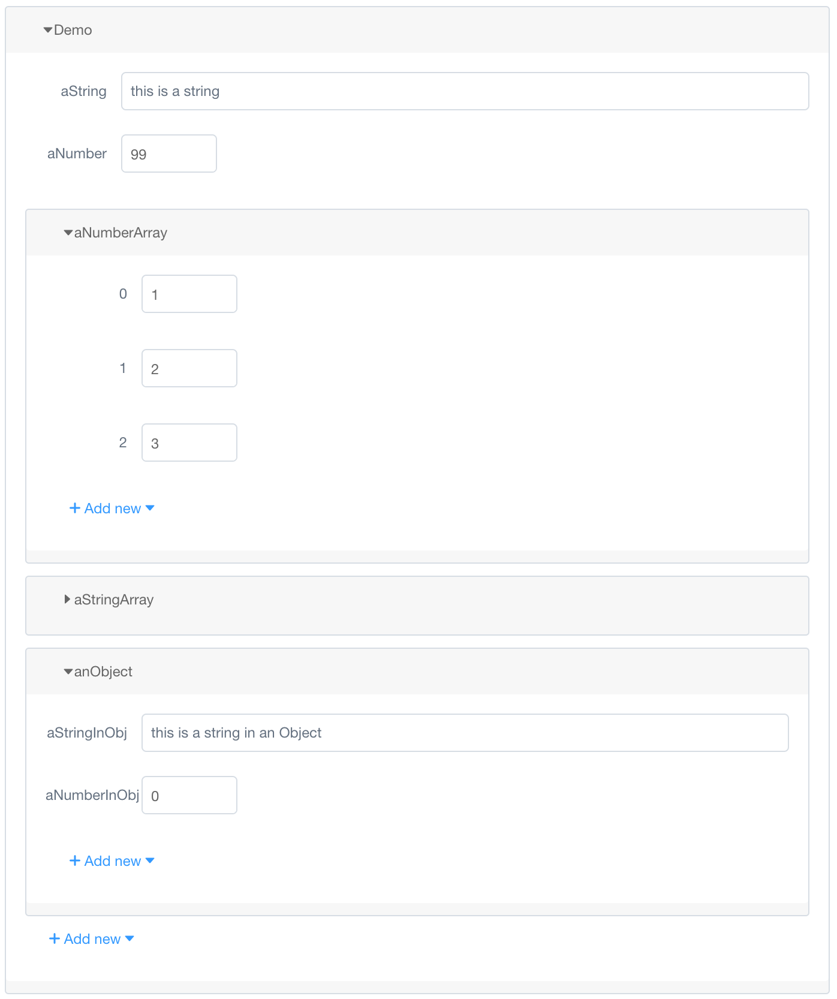

# vue-json-form

[](https://www.npmjs.com/package/vue-json-form)
[](https://www.npmjs.com/package/vue-json-form)
[](https://opensource.org/licenses/MIT)
[](https://github.com/fluency03/vue-json-form)

[](https://github.com/feross/standard)


A Vue.js component generating form from JSON.

This project is mainly for demonstrating how a JSON can be converted to a form view. No `submit`, `reset` or relevant form functionalities are implemented. All of this is due to one of [my another project](https://github.com/dockeron/dockeron), where I would like to do some configurations or settings via form but more suitable form API request parameter/body format.

[**Live Demo**](http://fluency03.com/demo/vue-json-form/)

TODOs:
- implement delete feature


## Usage

```javascript
git clone https://github.com/fluency03/vue-json-form
cd vue-json-form
npm install
npm run dev
```



